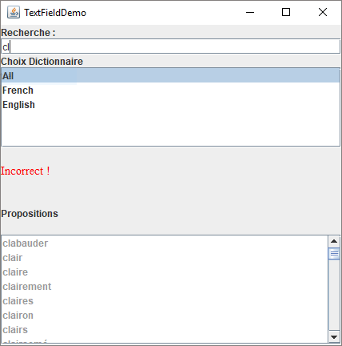

# TP2 : Développement avancé de logiciels: patrons et modèles (8INF956)

> Hiver 2018 : Maxime Chevalier - Antoine Gall

## Question 1

> Github : https://github.com/Aerlai/TP2-UQAC-9INF956-Q1


## Question 2

> Github : https://github.com/Chevalier-Maxime/UQAC_8INF956_TP2_Q2

### Version 1

> Outils de développement :
>
> * Eclipse Java Mars
> * Apache Felix Framework 2.0.0

Cette version est la version de base des 3 bundles, sans GUI.

Nous avons utilisé les tutoriels disponibles [ici](http://felix.apache.org/documentation/tutorials-examples-and-presentations/apache-felix-osgi-tutorial.html) pour réaliser cette version, et notamment les exemples 2,3 et 6.

Les fichiers de dictionnaires ont été téléchargé à [cette adresse](http://www.gwicks.net/dictionaries.htm). Ils contiennent une majorité des mots de la langue française et de la langue anglaise.

#### Bundle dictionnaires

Nous avons choisi de faire, en langue optionelle, un dictionnaire anglais.

Le bundle **TP2_Dico_En** contient 2 fichier:

* Le fichier Activator.java qui contient 2 classes :
  * Activator : Classe qui permet de lancer le bundle via la méthode start(). Dans cette méthode nous créons un objet dictionnaire en lui passant la référance du fichier txt où chercher les données.
  * La classe interne **DictionaryImpl** : Cette classe implémente l'interface ***DictionaryService***. Nous créons une liste qui contient tous les mots du fichier texte passé en paramètre afin de pouvoir facilement implémenter la fonction *checkWord* (fonction qui retourne vrais si le mot passé en paramètre est présent dans le dictionnaire, faux sinon) via la méthode *contains*. Cette classe implémente également la fonction *completeWord* qui retourne tous les mots du dictionnaire commencant par la chaine de cratères donnée en paramètre.
* Le fichier DictionaryService qui contient la classe du même nom. Cette classe définie 3 méthodes :
  * public String getLanguage() : qui permet de savoir la langue du dictionnaire
  * public boolean checkWord(String word) : qui permet de savoir si un mot appartient au dictionnaire
  * public List<String> completeWord(String word) : qui permet de retourner tous les mots du dictionnaire qui commencent par la chaine *word*.

Afin d'exporter le bundle, nous avons suivi les étapes du laboratoire. Nous avons également ajouté l'export de l'interface *DictionaryService* afin de pouvoir l'utiliser dans les futurs bundles. 

Le fichier MANIFEST.MF est le suivant :

```makefile
Manifest-Version: 1.0
Bundle-ManifestVersion: 2
Bundle-Name: %Bundle-Name
Bundle-SymbolicName: TP2_Dico_En
Bundle-Version: 1.0.0.qualifier
Bundle-Activator: tp2_dico_en.Activator
Bundle-Vendor: %Bundle-Vendor
Bundle-RequiredExecutionEnvironment: JavaSE-1.6
Import-Package: org.osgi.framework;version="1.3.0"
Export-Package: tp2_dico_en,
 tp2_dico_en.service
 
```


Le bundle **TP2_Dico_Fr **est similaire. Le fichier de dictionnaire est différent et il est composé du fichier *Activator* seulement. Nous utilisons le fichier MANIFEST.MF afin d'importer l'interface *DictionaryService* définie précédemment.

Le fichier MANIFEST.MF est le suivant :

```makefile
Manifest-Version: 1.0
Bundle-ManifestVersion: 2
Bundle-Name: %Bundle-Name
Bundle-SymbolicName: TP2_Dico_Fr
Bundle-Version: 1.0.0.qualifier
Bundle-Activator: tp2_dico_fr.Activator
Bundle-Vendor: %Bundle-Vendor
Bundle-RequiredExecutionEnvironment: JavaSE-1.6
Import-Package: org.osgi.framework;version="1.3.0",
 tp2_dico_en.service
Export-Package: tp2_dico_fr

```

#### Bundle client

Afin de pouvoir utiliser les services de dictionnaires enregistrés, nous avons créé le bundle **TP2_Dico_Client**. Ce bundle permet cherche les services de dictionnaires disponibles et, si il y en a, demande à l'utilisateur de rentrer un mot. Le bundle intéroge ensuite tous les services de dictionnaires qu'il connait via la méthode *checkWord*. Si un service de dictionnaire lui retourne vrais, alors l'utilisateur verra s'afficher le mot "Correct". Si le mot n'est présent dans aucuns dictionnaire, l'utilisateur verra le mot "Incorrect" s'afficher. De plus, le client va interroger tous les services de dictionnaires via la méthode *completeWord* et afficher tous les mots correspondant. 

Ce client prend en compte l'ajout et la suppréssion de services de dictionnaires en temps réél, grâce à un *ServiceListener*. Cependant, comme cette version est en ligne de commande, il faut avoir deux terminaux sur le même Felix (car le service est en mode textuel).

#### Compilation et lancement

Cette version utilise le framework Apache Felix version 2.0.0 (disponible sur le site du cours) qui est lancé via Eclipse Java Mars comme expliqué dans le laboratoire. Le JDK installé est 1.8 . Il faut compiler les bundles dans l'ordre suivant :

* TP2_Dico_En
* TP2_Dico_Fr
* TP2_Dico_Client

Ensuite il faut les installer dans Felix via la commande `install file:/<path>` puis les lancer via la commande `start <numéro>` 

### Version 2

Cette version utilise les mêmes bundles de services de dictionnaires que défini dans la version 1. C'est le bundle client qui change afin de proposer une interface graphique en Swing.

#### Bundle TP2_Dico_Client_GUI

> Développement : Eclipse Java Mars + Apache Felix 2.0.0
>
> Utilisation : Eclipse Java Oxygen + Apache Felix 5.6.10

Ce bundle est composé de deux fichiers :

* Le fichier Activator qui définie la classe du même nom : Cette classe est le point d'entrée du bundle. Elle implément l'interface BundleActivator (de base) et ServiceListener. Cette interface permet à la classe Activator d'être prévenu lorsqu'il y a un changement sur les services de dictionnaire (ajout/suppression).  Nous gardons en mémoire les différents services via les attributs m_refList et m_refToObjMap. Cette étend la classe Observable, ce qui va nous permettre de mettre à jour l'interface lorsqu'il y a un changement de service de dictionnaire.

* Le fichier FenetrePrincipale qui définie la classe du même nom. Cette classe étend la classe JFrame (Swing). Cette classe gère l'affichage et la logique métier. 

  L'interface graphique permet d'entrer un mot et de lancer la recherche lors de l'appui de la touche "entrée". Elle permet également de choisir dans quel dictionnaire chercher. L'interface affiche si le mot est correct ou non, et s'il ne l'est pas affiche les mots commençant par celui-ci.

  Cette application prend en charge l'ajout et la suppréssion de services (et met à jours la liste des services disponibles).

Afin de pouvoir utiliser swing, il faut ajouter l'import dans le MANIFEST.MF 

```makefile
Manifest-Version: 1.0
Bundle-ManifestVersion: 2
Bundle-Name: %Bundle-Name
Bundle-SymbolicName: TP2_Dico_Client_GUI
Bundle-Version: 1.0.0.qualifier
Bundle-Activator: tp2_dico_client.Activator
Bundle-Vendor: %Bundle-Vendor
Bundle-RequiredExecutionEnvironment: JavaSE-1.6
Import-Package: org.osgi.framework;version="1.3.0",
 tp2_dico_en.service,
 javax.swing
Import-Service: tp2_dico_en.service.DictionaryService
Export-Package: tp2_dico_client

```


#### Compilation et lancement

Ce bundle a été développé et compilé sur Eclipse Java Mars, avec Apache Felix Framework 2.0.0 installé. Cependant nous n'avions pas Java 1.6 d'installé sur notre machine pour compiler, alors nous avons dû lancer l'interface graphique sur Eclipse Java Mars avec la dernière version d'Apache Felix Framework. En effet, la version d'Apache Felix 2.0.0 n'arrive pas à trouver Swing avec java 1.8 . Si vous possédé le JDK 1.6 il ne devrait pas y avoir de problème pour lancer l'interface graphique.

Il faut compiler dans l'ordre suivant  :

* TP2_Dico_En
* TP2_Dico_Fr
* TP2_Dico_Client_GUI

Et ensuite installer les bundles dans felix. Ensuite vous pouvez lancer l'interface graphique et les dictionnaires dans l'ordre que vous voulez, et même arrêter/lancer des services de dictionnaires lorsque vous utilisez l'application.




## Question 3

